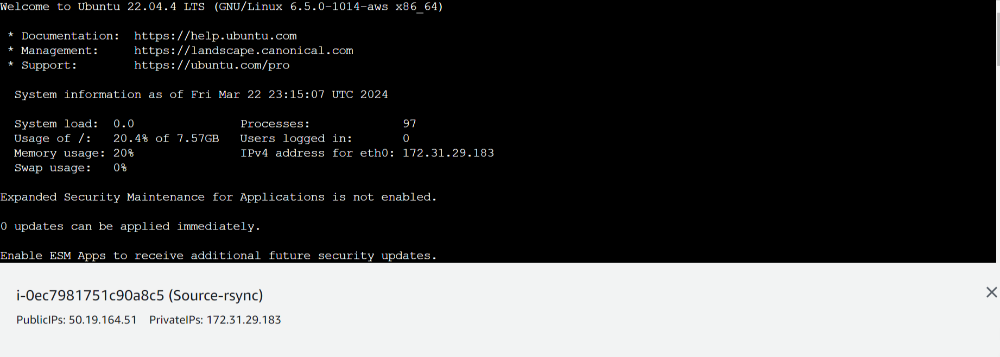
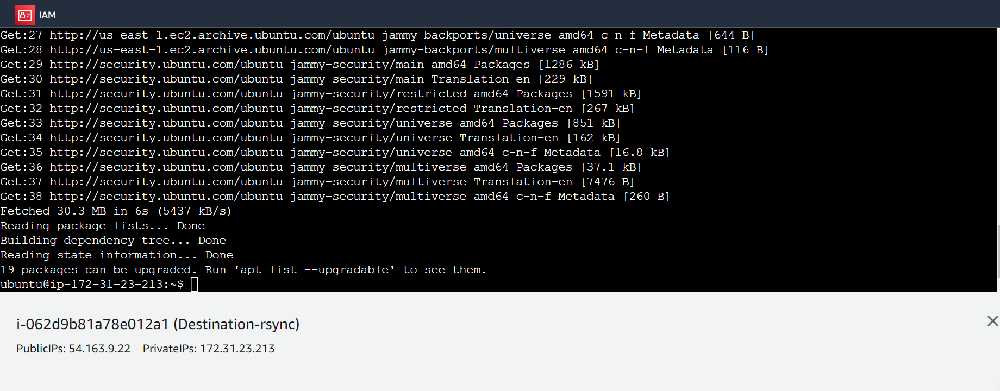
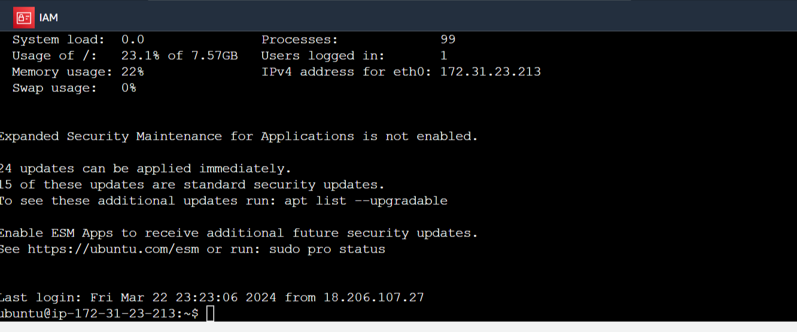
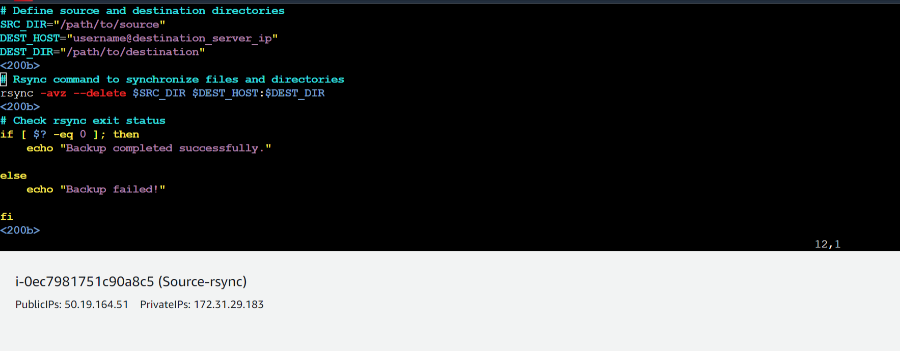
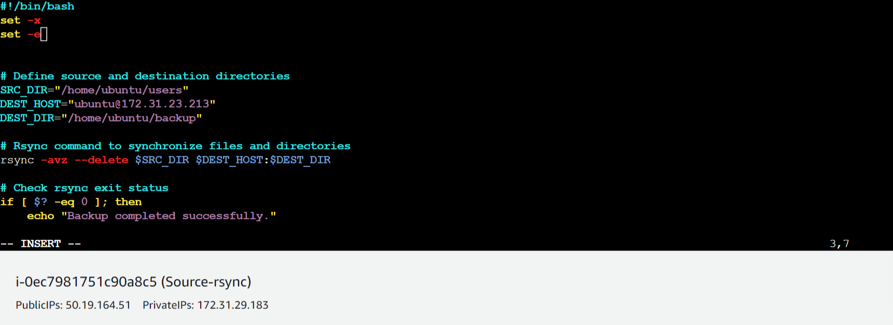
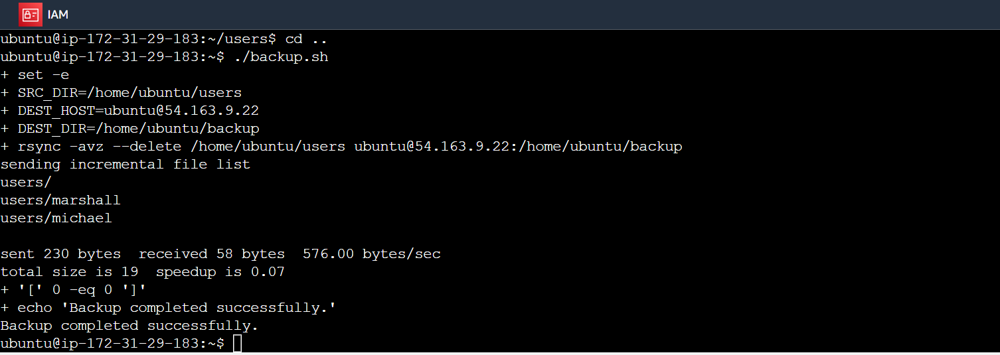
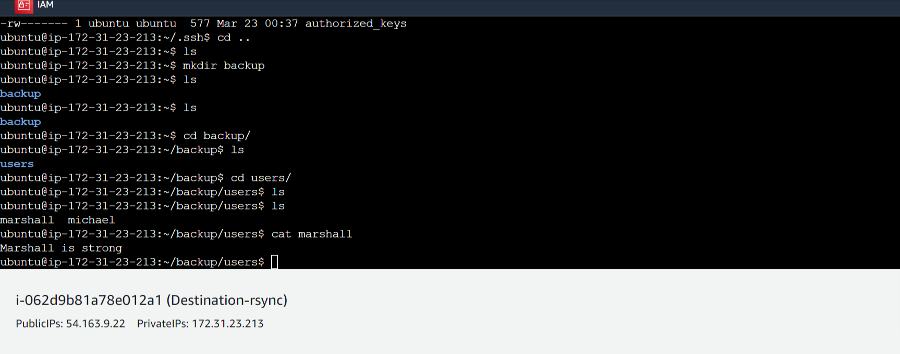
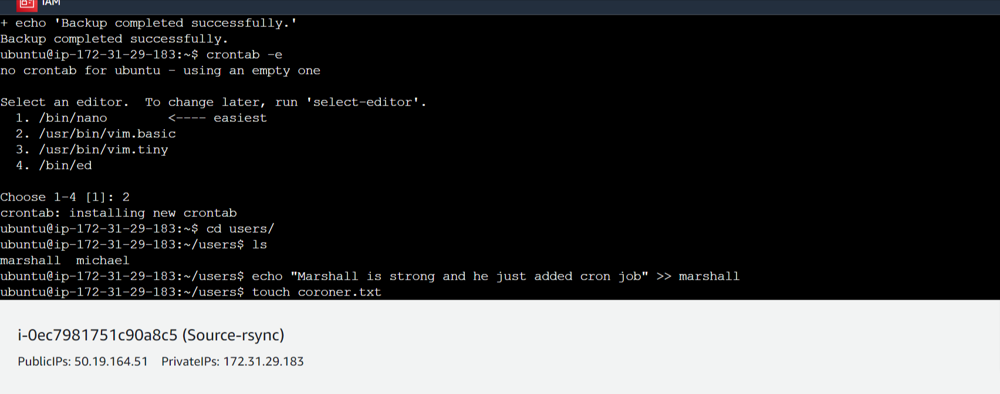

# rsync-project

This repository is for the implementation of back up between two servers using EC2 instance. We intend to backup the content of `server A` into `server B`. Sever A will serve as our main server where our files or data are stored, then server will be a backup incase anything happens to server A and it goes down.

This is a way to automate an administrative task.
We will learn how to sync one server with another using rsync.

## Introduction

`Rsync` is a powerful and versatile file synchronization tool that is commonly used in Unix-based systems. It allows for efficient synchronization of files and directories between different locations, either locally or over a network.

Rsync works by only transferring the differences between files, making it a very efficient tool for syncing large amounts of data. It also supports compression and encryption, making it a secure option for transferring files.

## Prerequisites

1. Two ubuntu servers - One will serve as `source` and the other will serve as `destination`.
2. `SSH` access to both servers
3. Good and basic knowledge of linux commands.

## STEPS -BY- STEPS IMPLEMENTATION

### Step-1 : Setup Source and destination servers on AWS

- launch 2 ubuntu servers on AWS, connect to the respective servers and run `sudo apt update`.

> Connection to Source Server (EC2 instance).



> Connection to the Destination Server.



- Install Rysnc on both servers

`sudo apt update`

`sudo apt install rsync`

### Step-2 : Configure SSH Key-based Authentication:

- Set up SSH key-based authentication between the source and destination servers to allow secure communication without password prompts.

The `Source server` should have the `Private key`, while the `Destination Server` should the `Public key` for before we can successfully SSH from one server into another.

- Generate an SSH key pair on the source server:

`ssh-keygen -t rsa`

You can use `ls -la` to check the hidden file (`.ssh`) that is just created.

Our goal is to copy the public key so generated form the Source server to the Destination server, so as to enable us SSH into the Destination server.

- Use `ssh-copy-id` to copy the `public ip` to the destination server.

```
ssh-copy-id username@target_server_ip_address
```

_if the above method doesn't work try copying it manually_

`cat ~/.ssh/id_rsa.pub`

- Copy the displayed text

- Run the command below in the destination sever

```
echo "your_copied_public_key_here" >> ~/.ssh/authorized_keys
```

- Change permission of authorized_keys

```
chmod 600 ~/.ssh/authorized_keys
```

- Once the public key has been copied try connecting to the destination server using SSH from the source server:

```
ssh username@target_server_ip_address
```



You can then exit the `Destination server` and return to the `Source server` by running `exit` command.

### Step-3 : Create Backup Script:

- Create a backup script in the source server

```
vi backup.sh
```

The below shall be the content of `backup.sh file`:

```
#!/bin/bash
​
set -x
set -e
​
​
# Define source and destination directories
SRC_DIR="/path/to/source"
DEST_HOST="username@destination_server_ip"
DEST_DIR="/path/to/destination"
​
# Rsync command to synchronize files and directories
rsync -avz --delete $SRC_DIR $DEST_HOST:$DEST_DIR
​
# Check rsync exit status
if [ $? -eq 0 ]; then
    echo "Backup completed successfully."

else
    echo "Backup failed!"

fi
​
```

> Open vim and edit the script.





- Here is a basic example don't forget to modify the parameters.

```
#!/bin/bash

set -x
set -e


# Define source and destination directories
SRC_DIR="/path/to/source"
DEST_HOST="username@destination_server_ip"
DEST_DIR="/path/to/destination"

# Rsync command to synchronize files and directories
rsync -avz --delete $SRC_DIR $DEST_HOST:$DEST_DIR

# Check rsync exit status
if [ $? -eq 0 ]; then
    echo "Backup completed successfully."

else
    echo "Backup failed!"

fi

```

- Save the script and exit.

- Make the script executable:

```
chmod +x backup.sh
```

> Create folders and files in the Source folder and run the bash script to back it up.
>
> 

> Backup Successful in Destination server
>
> 

### Step-4 : Schedule Backup with Cron:

- Edit the crontab file to schedule regular backups:

```
crontab -e
```

- Add a cron job to execute the backup script at the desired interval. for every 2hours:

```
0 */2 * * * /path/to/backup.sh
```

`To update a task every 2 minutes using crontab, you can use the following code:`

```
*/2 * * * * /path/to/your/script.sh
```


